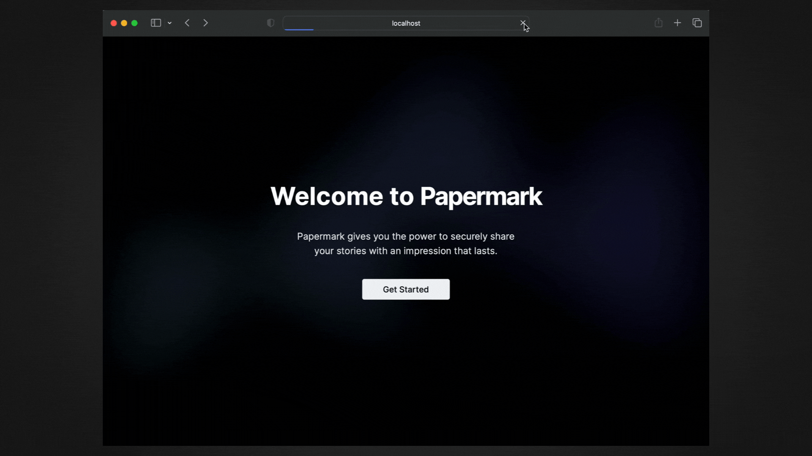

<div align="center">
  <h1 align="center">Papermark</h1>
  <h3>The open-source DocSend alternative.</h3>

<a target="_blank" href="https://www.producthunt.com/posts/papermark-3?utm_source=badge-top-post-badge&amp;utm_medium=badge&amp;utm_souce=badge-papermark"></a>

</div>

<div align="center">
  <a href="https://www.papermark.com">papermark.com</a>
</div>

<br/>

<div align="center">
  <a href="https://github.com/mfts/papermark/stargazers"></a>
  <a href="https://twitter.com/papermarkio"></a>
  <a href="https://github.com/mfts/papermark/blob/main/LICENSE"></a>
</div>

<br/>

Papermark is the open-source document-sharing alternative to DocSend, featuring built-in analytics and custom domains.

## Features

- **Shareable Links:** Share your documents securely by sending a custom link.
- **Custom Branding:** Add a custom domain and your own branding.
- **Analytics:** Gain insights through document tracking and soon page-by-page analytics.
- **Self-hosted, Open-source:** Host it yourself and customize it as needed.

## Demo



## Tech Stack

- [Next.js](https://nextjs.org/) – Framework
- [TypeScript](https://www.typescriptlang.org/) – Language
- [Tailwind](https://tailwindcss.com/) – CSS
- [shadcn/ui](https://ui.shadcn.com) - UI Components
- [Prisma](https://prisma.io) - ORM [](https://prisma.io)
- [PostgreSQL](https://www.postgresql.org/) - Database
- [NextAuth.js](https://next-auth.js.org/) – Authentication
- [Tinybird](https://tinybird.co) – Analytics
- [Resend](https://resend.com) – Email
- [Stripe](https://stripe.com) – Payments
- [Vercel](https://vercel.com/) – Hosting

## Getting Started

### Prerequisites

Here's what you need to run Papermark:

- Node.js (version >= 18.17.0)
- PostgreSQL Database
- Blob storage (currently [AWS S3](https://aws.amazon.com/s3/) or [Vercel Blob](https://vercel.com/storage/blob))
- [Resend](https://resend.com) (for sending emails)

### 1. Clone the repository

```shell
git clone https://github.com/mfts/papermark.git
cd papermark
```

### 2. Install npm dependencies

```shell
npm install
```

### 3. Copy the environment variables to `.env` and change the values

```shell
cp .env.example .env
```

### 4. Initialize the database

```shell
npm run dev:prisma
```

### 5. Run the dev server

```shell
npm run dev
```

### 6. Open the app in your browser

Visit [http://localhost:3000](http://localhost:3000) in your browser.

## Tinybird Instructions

To prepare the Tinybird database, follow these steps:

0. We use `pipenv` to manage our Python dependencies. If you don't have it installed, you can install it using the following command:
   ```sh
   pkgx pipenv
   ```
1. Download the Tinybird CLI from [here](https://www.tinybird.co/docs/cli.html) and install it on your system.
2. After authenticating with the Tinybird CLI, navigate to the `lib/tinybird` directory:
   ```sh
   cd lib/tinybird
   ```
3. Push the necessary data sources using the following command:
   ```sh
   tb push datasources/*
   tb push endpoints/get_*
   ```
4. Don't forget to set the `TINYBIRD_TOKEN` with the appropriate rights in your `.env` file.

#### Updating Tinybird

```sh
pipenv shell
## start: pkgx-specific
cd ..
cd papermark
## end: pkgx-specific
pipenv update tinybird-cli
```

## Contributing

Papermark is an open-source project, and we welcome contributions from the community.

If you'd like to contribute, please fork the repository and make any changes you'd like. Pull requests are warmly welcome.

### Our Contributors ✨

<a href="https://github.com/mfts/papermark/graphs/contributors">
  
</a>
