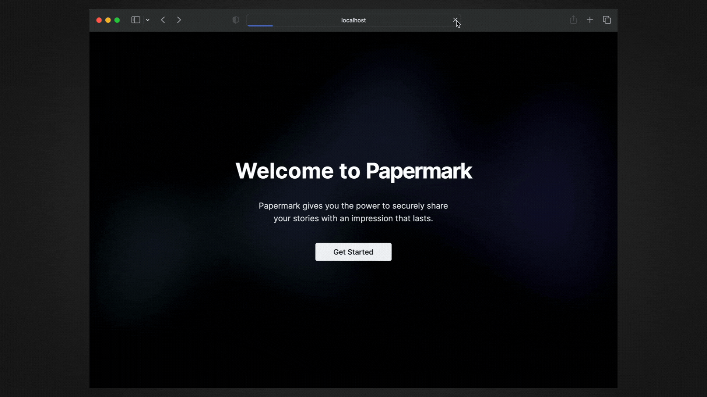

  <h1 align="center">Papermark</h1>
  <h3>The open-source DocSend alternative.</h3>

  <a href="https://www.papermark.com">papermark.com</a>

 

  
  
  

 

Papermark is the open-source document-sharing alternative to DocSend, featuring built-in analytics and custom domains.

## Features

- **Shareable Links:** Share your documents securely by sending a custom link.
- **Custom Branding:** Add a custom domain and your own branding.
- **Analytics:** Gain insights through document tracking and soon page-by-page analytics.
- **Self-hosted, Open-source:** Host it yourself and customize it as needed.

## Demo

## Tech Stack

- [Next.js](https://nextjs.org/) – Framework
- [TypeScript](https://www.typescriptlang.org/) – Language
- [Tailwind](https://tailwindcss.com/) – CSS
- [shadcn/ui](https://ui.shadcn.com) - UI Components
- [Prisma](https://prisma.io) - ORM 
- [PostgreSQL](https://www.postgresql.org/) - Database
- [NextAuth.js](https://next-auth.js.org/) – Authentication
- [Tinybird](https://tinybird.co) – Analytics
- [Resend](https://resend.com) – Email
- [Stripe](https://stripe.com) – Payments
- [Vercel](https://vercel.com/) – Hosting

## Contributing & Getting Started

Papermark is an open-source project, and we strongly welcome contributions from the community! 

Whether you just want to run Papermark locally or are looking to build new features, please check out our comprehensive **[Contributing Guidelines (CONTRIBUTING.md)](CONTRIBUTING.md)**. It covers everything from setting up your local environment (PostgreSQL, auth, Stripe, Tinybird) to branching strategies and submitting pull requests.

### Our Contributors ✨

